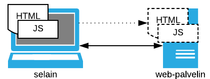

Edellisessä osassa esillä ollut *HTML* on kuvauskieli web-sivujen rakenteen ja
sisällön luomiseen, ja *CSS* kieli web-sivustojen tyylin määrittelyyn.
Tässä osassa käsiteltävä [JavaScript][mdn-js]
taas on kieli dynaamisen toiminnan lisäämiselle web-sivuille. JavaScriptilla voi
esim. muokata  selaimeen ladatun dokumentin rakennetta ja sisältöä
[DOM][mdn-dom][^1] -rajapintojen kautta.

{: style="display: block; margin: auto; margin-top: 10px; width: 350px;"}

Helsingin [Web-selainohjelmointi]({{weso}}) -materiaalissa JavaScriptin
perusteita ja DOM -rajapintoja käsitellään  seuraavasti:

[^1]: DOM: Document Object Model



[JavaScript]({{weso}}/#4-JavaScript)

1. [Funktiot]({{weso}}/#4.1-Funktiot)
2. [JavaScriptin lisääminen omille sivuille]({{weso}}/#4.2-JavaScriptin-lisääminen-omille-sivuille)
3. [JavaScriptin alkeita]({{weso}}/#4.3-JavaScriptin-alkeita)
4. [Web-sivun elementtien arvojen käsittely]({{weso}}/#4.4-Web-sivun-elementtien-arvojen-käsittely)
5. [Case: Laskin]({{weso}}/#4.5-Case:-Laskin)
6. [Case: Tyylien muuttaminen JavaScriptillä]({{weso}}/#4.6-Case:-Tyylien-muuttaminen-JavaScriptillä)

[DOM]({{weso}}/#5-DOM)

1. [Elementtien valinta]({{weso}}/#5.1-Elementtien-valinta)
2. [Elementtien lisääminen]({{weso}}/#5.2-Elementtien-lisääminen)
3. [Elementtien poistaminen]({{weso}}/#5.3-Elementtien-poistaminen)
4. [Tapahtumien käsittely]({{weso}}/#5.4-Tapahtumien-käsittely)

### Tehtävät

Tämän osan tehtävistä viisi ensimmäistä ovat ohjelmointitehtäviä. Kuudes tehtävä sisältää joukon monivalintakysymyksiä.



Ratkaisut tehtäviin tulee palauttaa Moodleen viimeistään **24.1.2018 klo 23:55**
("Moodlen aikaa"). Tehtäväkuvausten yhteydessä on linkit ao. palautustyökaluihin.

Kaikki ohjelmointitehtävät ovat peräisin Helsingin yliopiston [Web-selaiohjelmointi]({{weso}}) -materiaalista. Tehtävässä 2.3 laaditaan JavaScript-koodin ohella myös tyylitiedosto.

### Lisätietoja

Mozillan kehittäjäsivustolla on laaja [JavaScript][mdn-js]- ja [DOM][mdn-dom]-materiaali. Erilaisia oppaita ja käsikirja-aineistoa löytyy myös esim. [W3Schools][W3Schools] -sivustoilta. JavaSciptista on [ECMA-standardi][ecma]. DOM -rajapinnan [standardointi][dom-std] on W3C:n vastuulla.

[mdn-js]: https://developer.mozilla.org/en-US/docs/Web/JavaScript
[mdn-dom]: https://developer.mozilla.org/en-US/docs/Web/API/Document_Object_Model
[W3Schools]: https://www.w3schools.com/js/default.asp
[ecma]: https://tc39.github.io/ecma262/
[dom-std]:https://www.w3.org/DOM/

Esimerkki aihepiirin verkkokurssista on Udacityn
[Intro to JavaScript](https://eu.udacity.com/course/intro-to-javascript--ud803).
Kurssi sisältää seitsämän oppituntia koostuen mm. 64 lyhyestä videosta, joiden
yhteispituus on n. 1,5 tuntia. Kurssi käsittelee seuraavia aiheita:
tietotyypit ja muuttujat, ehtorakenteet, silmukat, funktiot, taulukot
sekä oliot.

[Udacity]: https://eu.udacity.com

 
