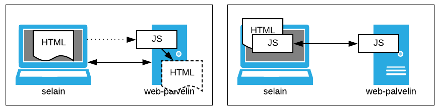

Kurssin edelliset osat käsittelivät selainpäässä tulkittavia tekniikointa:  *HTML*, *CSS* ja *JavaScript* sekä kahta näiden päälle rakentuvaa yleistä kirjastoa, *jQuery* ja *Bootstrap*. Tässä osassa fokus siirtyy palvelinpäähän. Tällä kurssilla myös palvelinpään ohjelmointikielenä toimii *JavaScript*, mutta sillä kirjoitettua koodia tulkitaa selaimen sijaan palvelinpäässä *Node:lla*.

*Node* sisältää joukon palvelinpään ohjelmointia tukevia moduuleja. Tässä *Node:n* verkko-moduulit kuitenkin peittää *Express* -sovelluskehys, jonka kyljessä käytetään *Handlebars* -sivupohjia. Tätä kalustoa luonnehditaan tuotteiden sivuistoilla seuraavasti:

> [Node.js][node] is a JavaScript runtime built on [Chrome's V8 JavaScript engine][v8]. Node.js uses an event-driven, non-blocking I/O model that makes it lightweight and efficient. Node.js' package ecosystem, [npm][npm-site], is the largest ecosystem of open source libraries in the world.
>
> [Express][express] is a minimal and flexible Node.js web application framework that provides a robust set of features for web and mobile applications.
>
> [Handlebars][handlebars] provides the power necessary to let you build semantic templates effectively with no frustration. Handlebars provides templates look like regular HTML, with embedded handlebars expressions.

[node]: https://nodejs.org
[express]: https://expressjs.com
[handlebars]: http://handlebarsjs.com
[v8]: https://developers.google.com/v8/
[npm-site]: https://www.npmjs.com



Helsingin [Web-selainohjelmointi]({{weso}}) -materiaalissa *Node:a*
käsitellään lyhyesti luvussa
[21. Palvelinohjelmointia JavaScriptillä - Node.js ja Express]({{weso}}/#21-Palvelinohjelmointia-JavaScriptillä---Node.js-ja-Express).
*Handlebars:in* sivustolla mainitaan, että *Handlebars*-templatet ovat osittain yhteensopivia [Mustache](https://github.com/janl/mustache.js/blob/master/README.md)-sivupohjien kanssa.
*Mustache* on esillä Helsingin materiaalissa kohdassa
[10.2. Näkymätemplatet ja Mustache.js]({{weso}}/#10.2-Näkymätemplatet-ja-Mustache.js), jossa
tosin sitä käsitellään selainpään näkökulmasta.

### Tehtävät

Tehtävissä on esillä periaatteeltaan kaksi erilaista web-arkkitehtuurimallia (*Kuva 1*).
Kuvan vasen puoli esittää tilannetta, jossa selain viittaa palvelimella olevaan ohjelmaan (kuvassa: *JS*).
Tämän seurauksena ohjelma käynnistyy ja tuottaa kokonaisen html-sivun, mikä
palautetaan selaimelle esitettäväksi.

Kuvassa oikealla on tilanne, jossa selainpäässä oleva ohjelma viittaa palvelinpään ohjelmaan,
jonka suorituksen seurauksena syntynyt tuotos välitetään selainpään ohjelmalle.
Tämä taas muokkaa selaimessa olevaa dokumenttia saamansa tiedon perusteella.

{: style="display: block; margin: auto; margin-top: 10px; width: 600px;"}

<small>Kuva 1. Web-arkkitehtuurimalleja.</small>

Osa sisältää kuusi tehtävää, josta viisi ensimmäistä ovat ohjelmointityyppisiä.
Kuudes tehtävä sisältää ohjelmointitehtäviin läheisesti liityviä monivalintakysymyksiä.



[Tehtävistä ensimmäinen](tehtava41) ei vielä liity mitenkään web-ohjelmointiin.
Siinä tunnustellaan *Node:n* käyttöä ilman sen verkko-ominaisuuksia ja lisäosia
laatimalla yksinkertainen konsolin kautta käytettävä nelilaskin.
[Seuraavassa tehtävässä](tehtava42) otetaan käyttöön *Express* -sovelluskehys.
Laadittava laskin toimii nyt hajautetusti webissä, mutta sen käyttöliittymä ei
ole kovinkaan kummoinen: laskutoimitus kuvataan osana laskentapalvelun osoitetta
ja selaimen ikkunaan saadaan laskennan tuloksena ainoastaan yksittäinen luku.
[Tehtävässä 4.3](tehtava43) laskimessa on Bootstrapilla ehostettu
html-käyttöliittymä, jonka tuottamiseen osallistuu *Handelbars*-sivupohjamoottori
(template engine). [Tehtävän 4.4](tehtava44) laskin on käyttäjän näkökulmasta
kutakuinkin edellisen kanssa samanlainen, mutta sen taustalla oleva arkkitehtuuri
on melko lailla erilainen. [Ohjelmointitehtävistä viimeisessä](tehtava45) on esillä
sovellus, joka muodostuu käyttäjän kannalta kolmesta sivusta, joiden yhteiset osat
on erotettu kaikkien sivupohjien hyödyntämäksi layoutiksi. Tehtävän pohjakoodiin
on myös upotettu esimerkki sivupohjissa käytettävissä olevasta silmukkarakenteesta.

Ratkaisut tehtäviin tulee palauttaa Moodleen viimeistään  <strike>7.2.2018</strike> **11.2.2018 klo 23:55**
("Moodlen aikaa"). Tehtäväkuvausten yhteydessä on linkit ao. palautustyökaluihin.

### Lisätietoja

Tässä esillä olevalla kalustolla on kattavat web-aineistot: [Node.js][node],
[Express][express], [Handlebars][handlebars]. Viimeksi mainitusta käytetään
erityisesti Express:in yhteyteen tarkoitettua versiota,
[express-handlebars][exp-hbs]. *W3Schools* -sivustolta löytyy
[Node-tutoriaali](https://www.w3schools.com/nodejs/default.asp).
[edX:ssä][edx] on suhteellisen tuore *Node*-kurssi,
[Introduction to Node.js](https://www.edx.org/course/introduction-node-js-microsoft-dev283x),
jossa *Node:n* ohella käsitellään *Express*-sovelluskehystä ja *MongoDB*-dokumenttitietokantaa.
[Coursera:n][coursera] *Responsive Web Design* -kurssilla käsitellään jonkin
verran *Handlebars*-sivupohjia:  [JavaScript templates with Handlebars][hb-lecture].

[exp-hbs]: https://github.com/ericf/express-handlebars/blob/master/README.md
[hb-lecture]: https://www.coursera.org/learn/responsive-web-design/lecture/pVzeZ/javascript-templates-with-handlebars

[edx]: https://www.edx.org
[coursera]: https://www.coursera.org
