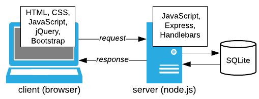

Edellä on tarkasteltu ensin web-sovellusten selainpäähän ("front-end") liittyviä tekniikoita
(Osat [1](../osa1), [2](../osa2), [3](../osa3)) ja sitten esimerkkejä palvelinpään ("backend")
ohjelmoinnissa käytettävistä tekniikoista ([Osa 4](../osa4)). Tässä osassa fokus
on edelleenkin palvelinpäässä: miten palvelinpään sovelluksissa voidaan käyttää
tietokantaa.

{: style="display: block; margin: auto; margin-top: 10px; width: 400px;"}

<small>Kuva 1. Tietokanta web-sovelluksissa.</small>

Esimerkkitietokantana  on *SQLite*, josta tuotteen sivustolla kerrotaan
seuraavaa:

> [SQLite][SQLite] is an in-process library that implements a self-contained, serverless, zero-configuration, transactional SQL database engine. The code for SQLite is in the public domain and is thus free for use for any purpose, commercial or private. SQLite is the most widely deployed database in the world with more applications than we can count, including several high-profile projects.

[SQLite]: https://www.sqlite.org

### Tehtävät

Osa sisältää kuusi tehtävää, josta viisi ensimmäistä ovat ohjelmointityyppisiä.
Kuudes tehtävä sisältää ohjelmointitehtäviin läheisesti liityviä monivalintakysymyksiä.



[Tehtävässä 5.1](tehtava51) perustetaan  hallintatyökalun
avulla  *viestit*-taulun sisältävä tietokanta sekä rakennetaan komentoriviltä
käytetävä sovellus, joka tulostaa tietokantataulun sisältämät viestit.
[Tehtävässä 5.2](tehtava52) sovellusta kehitetään edelleen siten, että
komentorivin kautta tietokantaan voidaa tallettaa uusia viestejä sekä poistaa
tietokannassa olevia viestejä.

Seuraavissa kolmessa tehtävässä sama tietokanta
integroidaan web-sovelluksen käyttöön. [Tehtävän 5.3](tehtava53) ratkaisussa
tietokannan
sisältämät viestit esitetään web-sivulla. Tehtävässä hyödynnetään myös
[evästettä](https://fi.wikipedia.org/wiki/Eväste), jonka sisältö vaikuttaa
hieman selaimessa esitettävän sivun ulkoasuun. [Tehtävässä 5.4](tehtava54)
sovellukseen laaditaan toiminto, jolla voidaan lisätä tietokantaan uusia viestejä.
[Tehtävässä 5.5](tehtava55) sovellusta kehitetään vielä siten, että sillä voidaan
sekä muokata että poistaa tietokantaan talletettuja viestejä.

Ratkaisut tehtäviin tulee palauttaa Moodleen viimeistään <strike>14.2.2018</strike>
**16.2.2018 klo 23:55**
("Moodlen aikaa"). Tehtäväkuvausten yhteydessä on linkit ao. palautustyökaluihin.

### Lisätietoja

Tässä käytettävän *SQLite*-järjestelmän [ymmärtämä SQL][SQLite-SQL] on
samanlaista kuin kieli, jota käsitellään
[Tiedonhallinta ja tietokannat][PLA-32602] -opintojaksolla. Tosin nyt SQL-komento
välitetään tietokannan suoritettavaksi tietynlaisen [sovellusrajapinnan][API]
kautta. Verkosta löytyvässä *SQLite-tutoriaalissa* on mm. tätä
[rajapintaa käsittelevä osa][sqlite-nodejs]. Esim. W3Schools-sivustolta
löytyy myös moninaista SQL-materiaalia, jonka joukossa on mm.
[SQL-komentojen pika-opas](https://www.w3schools.com/sql/sql_quickref.asp).

[SQLite-SQL]: https://www.sqlite.org/lang.html
[PLA-32602]: http://www.tut.fi/opinto-opas/wwwoppaat/opas2017-2018/pori/aineryhmat/Ohjelmistotekniikka/PLA-32602.html
[API]: https://github.com/mapbox/node-sqlite3/wiki/API
[sqlite-nodejs]: http://www.sqlitetutorial.net/sqlite-nodejs/
