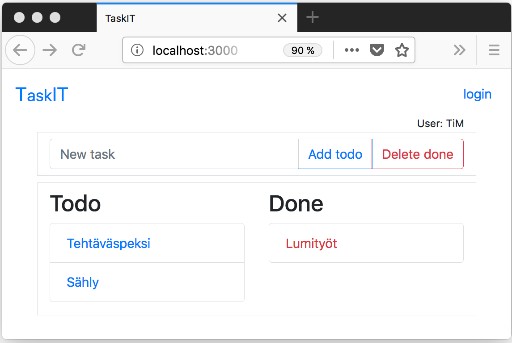

{: style="display: block;  margin: auto; margin-top: 10px; width: 500px;"}

<small>Kuva 1.</small>

### Tehtävät







Web-sovelluksissa palvelimelle tehtävät pyynnöt ovat toisistaan erillisiä siten, että tietojen siirrossa selaimen ja palvelimen välillä käytetty protokolla ei tunnista eri pyyntöjen yhteenkuuluvuutta. Mutta esim. verkkokauppasovellusten käyttäytymistä seuraamalla voidaan todeta, että jollakin tavalla pyynnöt saadaan kytkettyä toisiinsa: samaan ostoskoriin voidaan lisätä tuotteita eri pyynnöillä ja ostoskorin sisältö säilyy pyyntöjen välillä.

Tämän osan tehtävissä on esillä kaksi perusmekanismia tietojen välittämiseen pyyntöjen välillä, [evästeet][cookies][^1] ja [istunnot][sessions]. Molemmat ovat avain-arvopari -tyyppisiä tietovarastoja. Evästeet tallenetaan selainpäähän ja istuntodata palvelinpäähän. Tehtävien sovelluksen käyttöliittymä muodostuu kahdesta erillisestä sivusta, joista toisella kirjaudutaan sovellukseen ja toisella kirjautunut käyttäjä voi ylläpitää henkilökohtaista tehtäväluetteloa. Tieto kirjautumisesta tallennetaan osaksi istuntodataa ja kirjautumisen ajankohta evästeeseen, jonka arvon kumpikin sivu esittää.

[cookies]: https://www.w3schools.com/php/php_cookies.asp
[sessions]: https://www.w3schools.com/php/php_sessions.asp

[^1]: ks. myös [Viestintäviraston][virasto] näkökulma aiheeseen
[virasto]: https://www.viestintavirasto.fi/kyberturvallisuus/palveluidenturvallinenkaytto/evasteet.html

Sovelluksen käsittelemien tehtäväluetteloiden ylläpito toteutetaan tehtävissä kahdella eri tavalla, ensin tiedostoina ja sitten tukeutumalla relaatiotietokantaan. Tehtävissä on esillä myös kaksi erilaista sovelluksen toteutusperiaatetta, joista jälkimmäiseen viitataan usein termillä [Ajax][ajax].

[ajax]: https://fi.wikipedia.org/wiki/Ajax_(ohjelmointi)

### Tehtävät

Osa sisältää kolme tehtävää, joista kaikkien tuloksena on ulkoisesti samalla tavalla käyttäytyvä tehtäväluettelo -sovellus. Tehtävien lähtökohtana on eräs Washingtonin yliopiston [Web Programming][cse154]-kurssin kotitehtävä, jonka esikuva lienee eräs Webissä toimiva [vastaava palvelu](https://www.rememberthemilk.com).

[cse154]:https://courses.cs.washington.edu/courses/cse154/



[Tehtävässä 7.1](tehtava71) rakennetaan sovellukseen tiedostokäsittely sekä huomioidaan kirjautumisen yhteydessä *istuntoon* ja *evästeeseen* talletetut tiedot. [Tehtävässä 7.2](tehtava72) tiedostot korvataan [SQLite](https://www.sqlite.org)-tietokannalla. [Tehtävässä 7.3](tehtava73) sovelluksen rakennetta uudistetaan siten, että käyttäjän tehtävälistan esittävää sivua ei ladata  palvelimelta kokonaan uudelleen tehtävälista päivityksen jälkeen. Tieto tietokannan päivitystarpeesta välitetään palvelimelle, jonka jälkeen selaimessa olevaa dokumenttia muokataan päivityksen edellyttämällä tavalla.

  

 
