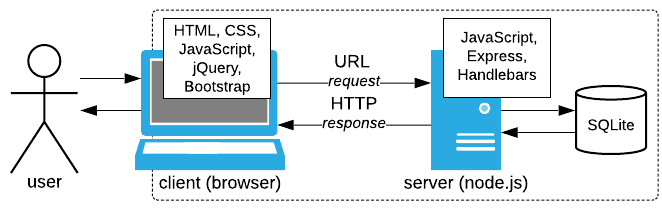

*Web-ohjelmointi* on aihepiirinsä johdantokurssi, joka käsittelee ohjelmoijan näkökulmasta web-sovelluksissa käytettyjä perustekniikoita kuten *HTML*, *CSS*, *JavaScript* ja *SQL*. Esillä on myös joukko yleisiä kehitystyötä tukevia koodikirjastoja. Seuraava kaavio jäsentää kurssilla käsiteltävää asiakokonaisuutta.

{: style="display: block; margin: auto; margin-top: 10px; width: 550px;"}

[Web-sovellusten][application] käyttöliittymänä toimii [selain][browser], joka tekee [HTTP][HTTP] -muotoisia pyyntöjä [web-palvelimelle][server] joko käyttäjän tai selaimen tulkitseman koodin ohjaamana. Tyypillinen vaste pyyntöön on [HTML][HTML] –dokumentti, joka voi sisältää myös [CSS][CSS] –tyyliohjeita ja [JavaScript][JavaScript] –koodia, joko suoraan tai viitteinä ulkopuolisiin tiedostoihin. [HTML][HTML] määrittelee dokumentin sisällön ja rakenteen [CSS][CSS]:n viimeistellessä dokumentin layoutin ja ulkoasun. [JavaScript][JavaScript] on selaimen tulkitsemaa ohjelmakoodia.

[application]: https://en.wikipedia.org/wiki/Web_application
[browser]: https://en.wikipedia.org/wiki/Web_browser
[HTTP]: https://fi.wikipedia.org/wiki/HTTP
[server]: https://fi.wikipedia.org/wiki/WWW-palvelin
[HTML]: https://fi.wikipedia.org/wiki/HTML
[CSS]: https://fi.wikipedia.org/wiki/CSS
[JavaScript]: https://fi.wikipedia.org/wiki/JavaScript

Selain voi pyynnössään viitata staattisen [HTML][HTML] -dokumentin sijaan myös palvelimella sijaitsevaan ohjelmaan, joka suoritetaan pyynnön seurauksena. Tällä kurssilla myös palvelinpään ohjelmointikielenä on [JavaScript][JavaScript]. Sovellukseen voi liittyä tietokanta – esim. pyynnön vasteen muodostaminen tietokannassa olevan tiedon perusteella. Usein käytössä on relaatiotietokanta, jota käsitellään [SQL][SQL]:n avulla. Tässä käytetään esimerkkinä [SQLite][SQLite]-relaatiotietokantaa.

[PHP]: https://fi.wikipedia.org/wiki/PHP
[SQL]: https://fi.wikipedia.org/wiki/SQL
[SQLite]: https://www.sqlite.org

Ks. [web-sovellusten ympäristöstä ja toteutustekniikoista](about)

Kurssitoteutus on jaettu seitsemään osaan, joista kunkin ytimen muodostaa
osan teemaan keskittyvä tehtäväsarja:



Opintojaksolla ei ole varsinaista luento-opetusta. Kurssin osiin liittyvät
tehtäväsarjat määrittelevät opiskeltavan aineksen. Osallistujien odotetaan
tutustuvan tehtävien ratkaisua tukevaan taustamateriaalliin itsenäisesti.
Kontaktitunnit on varattu ensisijaisesti tehtävien ratkaisemiseen. Etäopiskelun
tukimuotoina ovat tehtäväkohtaiset Moodle-keskustelut sekä koodikatselmukset.

Kurssin perustyökaluksi soveltuu [NetBeans IDE][NetBeans] -paketti, jossa on mukana
*HTML5/JavaScript* -kalusto, tai jokin tekstieditori kuten
[Notepad++](https://notepad-plus-plus.org) tai [Atom](https://atom.io).
Selaimista oletuksena on [Firefox][Firefox].

[Firefox]: https://www.mozilla.org/fi/
[NetBeans]: https://netbeans.org/

[Aikataulu](aikataulu)   
[Suorituksen arvostelu](arvostelu)   
[Tehtävien katselmointipyynnöistä](katselmukset)

[Edellinen kurssitoteutus (2016/17)](https://timedu.github.io/jwo2017k/)
