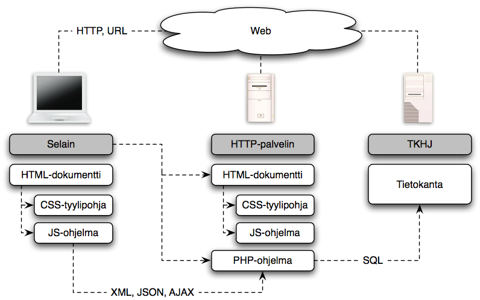

[Web-sovellusten ympäristöstä ja toteutustekniikoista](about)

Kurssitoteutus on jaettu seitsemään osaan, joista kunkin ytimen muodostaa
tiettyyn teemaan keskittyvä tehtäväsarja:



[Suorituksen arvostelu](arvostelu)   
[Edellinen kurssitoteutus (2016/17)](https://timedu.github.io/jwo2017k/)

~~~
Sivusto täydentyy ja päivittyy kurssitoteutuksen edetessä
~~~



*Web-ohjelmointi* on aihepiirinsä johdantokurssi, joka käsittelee ohjelmoijan näkökulmasta web-sovelluksissa käytettyjä perustekniikoita kuten HTML[^HTML], CSS[^CSS], *JavaScript*, PHP[^PHP] ja SQL[^SQL]. Kurssin keskeisiä työvälineitä ovat [Firefox][Firefox] -selain ja integroitu sovelluskehitysympäristö, [NetBeans IDE][NetBeans][^IDE]. Esillä olevia tekniikoita voidaan jäsentää oheisella kaaviolla.

[^HTML]: HTML: Hypertext Markup Language
[^CSS]: CSS: Cascading Style Sheets
[^PHP]: PHP: PHP Hypertext Preprocessor
[^SQL]: SQL: Structured Query Language
[^IDE]: IDE: Integrated Development Environment

[Firefox]: https://www.mozilla.org/fi/
[NetBeans]: https://netbeans.org/

{: style="max-width: 500px; height: auto; display: block; margin: auto;"}

[Web-sovellusten][application] käyttöliittymänä toimii [selain][browser], joka tekee [HTTP][HTTP][^HTTP]-muotoisia pyyntöjä [web-palvelimelle][palvelin] joko käyttäjän tai selaimen tulkitseman koodin ohjaamana. Tyypillinen vaste pyyntöön on [HTML][HTML] – dokumentti, joka voi sisältää myös [CSS][CSS] – määreitä ja [JavaScript][JavaScript] – koodia, joko suoraan tai viitteinä ulkopuolisiin tiedostoihin. [HTML][HTML] määrittelee dokumentin sisällön ja rakenteen [CSS][CSS]:n viimeistellessä dokumentin layoutin ja ulkoasun. [JavaScript][JavaScript] on selaimen tulkitsemaan ohjelmakoodia, joka voi muokata selaimen esittämää dokumenttia erityisen [DOM][DOM][^DOM] – rajapinnan kautta. [JavaScript][JavaScript] osaa myös tehdä palvelimelle, tyypillisesti asynkronisia, [HTTP][HTTP] – pyyntöjä, mihin viitataan usein lyhenteellä [Ajax][Ajax][^Ajax].

[^HTTP]: HTTP: Hypertext Transfer Protocol
[^DOM]: DOM: Document Object Model
[^Ajax]: Ajax: Asynchronous JavaScript And XML

[application]: https://en.wikipedia.org/wiki/Web_application
[browser]: https://en.wikipedia.org/wiki/Web_browser
[HTTP]: https://fi.wikipedia.org/wiki/HTTP
[palvelin]: https://fi.wikipedia.org/wiki/WWW-palvelin
[HTML]: https://fi.wikipedia.org/wiki/HTML
[CSS]: https://fi.wikipedia.org/wiki/CSS
[JavaScript]: https://fi.wikipedia.org/wiki/JavaScript
[DOM]: https://fi.wikipedia.org/wiki/Document_Object_Model
[Ajax]: https://fi.wikipedia.org/wiki/Ajax_%28ohjelmointi%29

Selain voi pyynnössään viitata staattisen [HTML][HTML] – dokumentin sijaan myös palvelimella sijaitsevaan ohjelmaan, joka suoritetaan pyynnön seurauksena. Tällä kurssilla palvelinpään ohjelmointikielenä on [PHP][PHP]. Sovellukseen voi liittyä myös tietokanta – esim. pyynnön vasteen muodostaminen tietokannassa olevan tiedon perusteella. Usein käytössä on relaatiotietokanta, jota käsitellään [SQL][SQL]:n avulla. Tässä käytetään esimerkkinä [SQLite][SQLite]-relaatiotietokantaa. Kurssilla käytettävä web-palvelin on integroitu IDE:en ja toisaalta PHP-tulkkiin.

[PHP]: https://fi.wikipedia.org/wiki/PHP
[SQL]: https://fi.wikipedia.org/wiki/SQL
[SQLite]: https://www.sqlite.org

Kurssi on jaettu seitsemään osaan, joista kunkin ytimen muodostaa tiettyyn teemaan keskittyvä tehtäväsarja:



Kahden ensimmäisen osan lähtökohtana on Helsingin yliopiston [Web-selainohjelmointi -kurssin][weso] alkuosa (materiaalista luvut 2-5). Osat 3 ja 4 muodostaa [Viope][viope] -oppimisympäristön kurssi *PHP -ohjelmoinnin perusteet*. Osien 5-7 soveltavien tehtävien pääasiallisena lähteenä on Washintonin yliopiston [Web Programming -kurssin][cse154] materiaali.

[weso]: http://web-selainohjelmointi.github.io
[viope]: https://www.viope.com/
[cse154]: https://courses.cs.washington.edu/courses/cse154/

Opintojaksolla ei ole varsinaista luento-opetusta. Kurssin osiin liittyvät tehtäväsarjat määrittelevät opiskeltavan aineksen. Osallistujien odotetaan tutustuvan tehtävien ratkaisua tukevaan taustamateriaalliin itsenäisesti. Kontaktitunnit on varattu ensisijaisesti tehtävien ratkaisemiseen. Kuhunkin kurssin osaan liittyy 3h kontaktitilaisuus, jonka yhteydessä saa tukea tehtävien ratkaisemiseen. Muita tukimuotoja ovat tehtäväkohtaiset Moodle-keskustelut ja tehtävissä laadittavaan koodiin liittyvät etäkatselmukset. Tentit tehdään EXAM-luokan koneissa, joissa on käytettävissä kehitysvälineistö sekä tukidokumentaatiota.

#### Lisätietoja kurssista

[Aikataulu](aikataulu)   
[Suorituksen arvostelu](arvostelu)   
[Tehtävien katselmointipyynnöt](katselmukset)   
[Kurssin konteksti](konteksti)   
[Edellinen kurssitoteutus](http://txp.avoinsatakunta.fi/weo/)   

[Yhteenveto kurssitoteutuksesta](yhteenveto)

 


